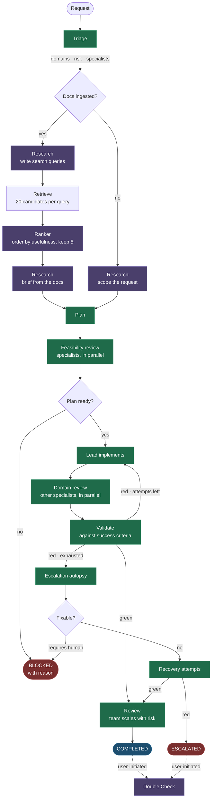

# AutoRnD

[](https://www.python.org/downloads/)
[](LICENSE)
[](#testing)

**An open-source multi-model agentic engineering harness.**

AutoRnD replaces single-model AI assistants with a coordinated engineering team that plans, implements, validates, and iterates on engineering objectives — routing each phase to whichever model you think fits it.

Instead of asking one expensive model to do everything, AutoRnD splits the work into tiers: a cheap model triages, a mid-tier model implements, a heavyweight model plans, a reasoning model diagnoses failures. **You choose every model.** AutoRnD ships no defaults and recommends none — it is the harness, not the opinion.

---

## Table of Contents

- [What AutoRnD Produces](#what-autornd-produces)
- [Architecture](#architecture)
- [Model Tiers](#model-tiers)
- [Choosing Models](#choosing-models)
- [Research and Ranking](#research-and-ranking)
- [Engineering Specialists](#engineering-specialists)
- [Review Team Composition](#review-team-composition)
- [Escalation Autopsy](#escalation-autopsy)
- [Prerequisites](#prerequisites)
- [Quick Start](#quick-start)
- [Configuration](#configuration)
- [Project Profiles](#project-profiles)
- [Knowledge Store](#knowledge-store)
- [Lead + Review Implementation](#lead--review-implementation)
- [Double Check](#double-check)
- [Multi-User and Authentication](#multi-user-and-authentication)
- [Settings Dashboard](#settings-dashboard)
- [API](#api)
- [Worked Example](#worked-example)
- [Project Structure](#project-structure)
- [Cost and Performance](#cost-and-performance)
- [Testing](#testing)
- [Deployment](#deployment)
- [Limitations](#limitations)
- [Contributing](#contributing)
- [License](#license)

---

## What AutoRnD Produces

**AutoRnD produces engineering artifacts as text, and nothing else.** This is the single most important thing to understand before using it.

It has no repository, shell, or build tools. It does not compile, run, deploy, or edit files. Every phase returns a typed Pydantic object whose content is written engineering work — a plan, a design, a schema, a procedure, a calculation, code as text — that you or your own pipeline then apply.

Every prompt states this contract to the model explicitly, in both directions:

- **Producing phases** are told their response *is* the deliverable, and never to reply that they lack repository access.
- **Assessing phases** are told they are judging a written implementation, and that "it has not been run" is not a defect.

This matters more than it sounds. Without both halves stated, a capable model asked to "implement" correctly reports that it cannot reach your filesystem, the validator correctly rejects an implementation that does not exist, and the loop burns every iteration before escalating — turning a routine request into a long, expensive, failed run.

The same reasoning shapes the plan phase: **success criteria must be verifiable by reading the implementation**, not by measuring a running system. `reconnect loop applies exponential backoff capped at 60s with jitter` can be checked. `reconnects within 30s in production` cannot, and will stall the loop forever.

Each phase returns:

| Phase | Verdict |
|---|---|
| Triage | domains, risk level, assigned specialists |
| Plan | implementation plan, success criteria, blockers, optional cost estimate |
| Feasibility | per-specialist go/no-go on the plan |
| Implement | the implementation itself, plus green/red status |
| Validate | pass/fail with per-criterion evidence |
| Review | ship/block with findings from the review team |
| Escalation | root cause, recovery directive or human-intervention flag |

Gate logic reads typed fields directly — `green == true` drives the implement/validate loop. No English parsing anywhere.

## Architecture



Green nodes are required model tiers; purple are optional ones you can leave unset, in which case the workflow simply runs without that step. Unshaded steps (retrieval, gates) run locally and cost nothing.

## Model Tiers

AutoRnD routes each phase to a named tier. **You decide what fills every tier**, and the harness will not start until you do. There are no defaults, because model quality, pricing and availability change faster than any README, and the right choice depends on your provider, budget and domain.

**Required** — these run on every workflow, and AutoRnD will not start without them:

| Tier | Phases | Calls per workflow | Optimise for |
|---|---|---|---|
| **Engineering** | Implement, validate, review, feasibility | Most of them | Capability at volume. This tier dominates your bill. |
| **Architecture** | Plan, critical review | 1–2 | Reasoning quality. A weak plan wastes every token spent after it. |
| **Triage** | Triage | 1 | Price, and reliably valid JSON. The cheapest thing that classifies correctly. |
| **Escalation** | Failure autopsy | 0–1 | Depth on long, messy input. Rarely called, so expensive is affordable. |

**Optional** — each turns a feature off when left empty:

| Tier | Job | Calls per workflow | Runs when |
|---|---|---|---|
| **Ranker** | Orders retrieved documentation by usefulness | 0–1 | You have ingested project docs |
| **Research** | Briefs the other phases before work starts — from your docs, or by scoping the request when there are none | 1–2 | Always, once configured |
| **Premium** | Independent Double Check review | 0–1, user-initiated | You click the button |

All tiers accept any model your provider serves, in `provider/model` form. The client speaks the OpenAI chat-completions protocol, so any compatible endpoint works.

On startup AutoRnD validates every configured model against your provider's catalogue and reports the result:

```
Model check: 5/5 models available
```

If a model cannot be verified, `/api/health` reports `degraded` and names the tiers in `unverified_models`, and the dashboard shows a banner. Models that a provider serves but omits from its chat-model listing — rerankers and embedding models, typically — are confirmed individually rather than reported missing.

## Choosing Models

A workable approach if you are starting from nothing:

1. **Start with Engineering.** It runs implement, validate, review and feasibility, so it is called more than every other tier combined. Pick the best model you can afford to run repeatedly.
2. **Do not economise on Architecture.** It runs once or twice, but its plan constrains everything downstream.
3. **Make Triage the cheapest model that returns valid JSON reliably.** It does classification, not reasoning.
4. **Put a reasoning model in Escalation.** It only runs after the loop has already failed, so its cost is rare by construction.
5. **Consider Research early.** With no documentation it still makes each workflow's assumptions explicit rather than implicit, which is worth one small call. Whether it reduces iterations is not something we have measured — treat it as a legibility feature, not a performance one, until you have measured it on your own workloads.
6. **Leave Ranker and Premium empty** to begin with. Ranker does nothing until you ingest documentation; Premium is opt-in.

Then watch your provider's usage dashboard for a few workflows and adjust. The per-phase call counts in [Cost and Performance](#cost-and-performance) tell you which tier your spend will actually land on.

## Research and Ranking

These are two separate jobs on the same pipeline, which runs once per workflow, straight after triage. The **ranker** is idle until you [ingest project docs](#knowledge-store) — there is nothing to rank before then. The **research** tier is useful either way.

**With documentation ingested:**

```
request → research: write search queries
        → retrieve: 20 candidates per query, de-duplicated
        → ranker:   order by usefulness, keep the best 5
        → research: read those and write a grounded briefing
        → every downstream phase receives the briefing
```

**With an empty knowledge store** — which is every fresh install — research scopes the request instead:

```
request → research: restate the objective, list what is unspecified,
                    state the assumptions being made
        → every downstream phase receives the analysis
```

### Ranker

Retrieval finds chunks that are *about* the right subject; it is much worse at ordering them against each other. The ranker decides which of the material actually helps, and AutoRnD retrieves a wide candidate set specifically so there is something worth ranking — you cannot rank what you never retrieved.

Fill this tier either way:

- **A purpose-built rerank model.** Scores query/document pairs rather than generating text, so it is cheaper, faster and sharper than asking a chat model. Used automatically when your provider serves one.
- **Any chat model.** Falls back to listwise ranking — all candidates in one prompt, asking for an ordering.

Rerank models often do not appear in a provider's chat-model listing. AutoRnD confirms them individually, so a valid one is not reported missing.

Selection is automatic and probed once per process:

```
native rerank API  →  listwise chat ranking  →  embedding-distance order
```

Leave it empty and ranking falls to the research tier, then to raw retrieval order.

### Research

The research tier does the reading, and it has something to do whether or not you have documentation.

**When you have docs**, it runs twice per workflow, both calls small:

**Before retrieval**, it turns the request into 2–4 targeted search queries — aiming at what the work will need settled (interfaces to match, constraints to respect, behaviour not to break) rather than restating the request. Retrieving on the raw request finds documents about the subject; retrieving on real queries finds the ones that answer the question.

**After ranking**, it reads the top excerpts and writes a grounded briefing for every downstream phase: the constraints, interfaces and values this work must respect, with sources cited — plus an explicit list of **what the documentation does not cover**, so the architect knows where it is working without ground truth instead of quietly assuming.

**When you have no docs**, it runs once and scopes the work instead: restating the objective precisely, listing what the request leaves unspecified that the work genuinely needs settled, and stating the assumptions a competent engineer would proceed on — written so they can be challenged rather than buried unexamined in a plan.

That output is labelled `REQUEST ANALYSIS (no project documentation available — assumptions, not facts)` so no downstream phase mistakes an assumption for a project fact. The prompt is explicit that unknowns are reported, never filled in.

Optimise for faithful summarisation and a context window that fits your excerpts. It must not invent facts.

Leave it empty and every phase runs on the raw request alone.

## Engineering Specialists

Seven specialists, each with a domain focus, a system prompt, and a tier:

| Specialist | Domain | Tier |
|---|---|---|
| Systems Architect | Architecture, integration, trade-off analysis | Architecture |
| Firmware Engineer | Embedded systems, microcontrollers, RTOS, power management | Engineering |
| Hardware Engineer | Board design, bill of materials, schematic, thermal | Engineering |
| Backend Engineer | Services, APIs, databases, data pipelines | Engineering |
| Frontend Engineer | UI frameworks, data visualisation, responsive design | Engineering |
| Test Engineer | Validation plans, test protocols, quality assurance | Engineering |
| Supply Chain | Cost, sourcing, compliance | Engineering |

Triage assigns specialists per workflow. The Systems Architect always plans and the Test Engineer always validates; the rest review and implement according to risk. Every specialist's grounding can be overridden in your [project profile](#project-profiles).

## Review Team Composition

Team size scales with risk rather than throwing everyone at every problem:

| Risk | Team | Mode |
|---|---|---|
| Critical | All specialists | Adversarial |
| High | Domain specialists + test + architect | Adversarial |
| Medium | Domain specialist + test or architect | Standard |
| Low | Single relevant specialist | Standard |

Validation also adapts. The validate phase injects deterministic checks for the domains the request actually touches — reconciling quantities and costs for hardware work, state-machine reachability for firmware, schema consistency for backend, empty/loading/error states for frontend. A copy change is never asked whether its pin assignments conflict.

## Escalation Autopsy

When the implement/validate loop exhausts `MAX_ITERATIONS`, most systems give up. AutoRnD routes a structured autopsy to the escalation tier:

1. **Static context** (system prompt) — the plan, project docs, success criteria
2. **Dynamic context** (user message) — the failure log from every failed attempt
3. **Constrained output** — strict schema, hard token cap to prevent runaway reasoning cost
4. **Recovery or stop** — if fixable, the failed context is scrubbed and the directive drives fresh attempts. If it needs a human, the run stops cleanly and says why.

The escalation model never implements. It diagnoses and directs; the engineering tier executes.

## Prerequisites

- **Python 3.11+**
- **An API key** for any OpenAI-compatible provider
- **Docker** (optional)

## Quick Start

```bash
git clone https://github.com/ohioy000/autornd-os.git
cd autornd-os

cp .env.example .env
# Add your API key and choose a model for each tier — AutoRnD ships no defaults

pip install -r requirements.txt
uvicorn autornd.main:app --port 8100
```

Open `http://localhost:8100` for the chat interface and workflow dashboard.

If a tier is unset, AutoRnD refuses to start and tells you exactly which:

```
AutoRnD is not configured — no model is set for 2 of 5 tiers.

AutoRnD ships no default models. You choose what runs at each tier:

  MODEL_TRIAGE         classification and routing — cheapest tier
  MODEL_ESCALATION     failure autopsy and recovery — reasoning tier
```

### Docker

```bash
docker build -t autornd .
docker run -p 8100:8100 --env-file .env autornd
```

Mount your own docs and profiles:

```bash
docker run -p 8100:8100 --env-file .env \
  -v ./profiles:/app/profiles \
  -v ./docs:/app/docs \
  -e AUTORND_PROFILE=my-project \
  autornd
```

## Configuration

Every setting lives in `.env` — see [`.env.example`](.env.example), which documents all of them. The essentials:

```bash
OPENROUTER_API_KEY=
OPENROUTER_BASE_URL=https://openrouter.ai/api/v1   # or any compatible endpoint

MODEL_TRIAGE=             # required
MODEL_ENGINEERING=        # required
MODEL_ARCHITECTURE=       # required
MODEL_ESCALATION=         # required

MODEL_RANKER=             # optional, ranks retrieved docs
MODEL_RESEARCH=           # optional, briefs phases from the docs
MODEL_PREMIUM=            # optional, enables Double Check

MAX_ITERATIONS=5          # 1-20
ESCALATION_MAX_TOKENS=4096
ESCALATION_RECOVERY_ATTEMPTS=3

API_HOST=127.0.0.1        # containers need 0.0.0.0
API_PORT=8100
```

The bind address defaults to loopback. AutoRnD has no rate limiting and spends real money, so do not expose it directly — see [Deployment](#deployment).

## Project Profiles

AutoRnD ships with no domain assumptions. You bring the context.

### 1. Write a profile

```yaml
# profiles/packaging-line.yaml
name: "PackagingLine"
description: "Control and vision systems for a cup-style food packaging machine"
stack:
  - "Servo-driven indexing conveyor"
  - "Laser presence sensors on the fill station"
  - "PLC control with an industrial PC supervisor"
  - "Python/FastAPI line-monitoring service"
constraints:
  - "Washdown environment, IP69K on anything in the fill zone"
  - "Food-contact materials must be FDA compliant"
  - "Line stops cost more than any component on it"
specialists:
  hardware_engineer:
    context: "24V DC distribution, shielded sensor runs, washdown-rated connectors"
  firmware_engineer:
    context: "Deterministic cycle timing, fail-safe on sensor loss"
```

### 2. Add documentation

The docs directory is derived from the profile's **`name:` field**, lowercased with spaces replaced by underscores — not from the filename. A profile named `"PackagingLine"` reads from `docs/packagingline/`:

```
docs/
  packagingline/
    manifest.json
    line-architecture.md
    sensor-placement.md
```

A missing directory is skipped silently, so check `python -m autornd.cli stats` if your docs do not seem to load.

### 3. Select it

```bash
AUTORND_PROFILE=packaging-line uvicorn autornd.main:app --port 8100
# or set AUTORND_PROFILE in .env, or switch at runtime in the Settings tab
```

## Knowledge Store

Documentation is chunked into a local ChromaDB store and retrieved per workflow.

```bash
# Ingest everything for a profile
python -m autornd.cli init-knowledge --profile packaging-line

# Ingest one file or directory
python -m autornd.cli ingest path/to/doc.md

# Inspect and query
python -m autornd.cli stats
python -m autornd.cli query "laser sensor wiring" -n 5
```

The store ships empty. Until you ingest something, workflows run on the profile text alone and the research tier is never called.

## Lead + Review Implementation

The implementation phase uses a **lead + review** pattern rather than running specialists in parallel.

**The problem it solves:** parallel specialists produce contradictory designs — one plans a polling architecture while another plans an event-driven one. The validator rejects the merged result, and the loop spends every iteration on irreconcilable designs.

**How it works:**

1. **Lead selection** — triage identifies the primary domain, which maps to a lead specialist.
2. **The lead implements alone**, producing one coherent implementation.
3. **Domain review** — if the lead's work is green, the other assigned specialists review it in parallel with a scoped prompt: *review from your domain perspective, flag concerns, do not produce an alternative design.*
4. **Critical concerns gate** — any critical concern flips `green` to false and is passed to the validator. Non-critical concerns are recorded.

This keeps the multi-specialist value without the merge conflicts.

## Double Check

An optional independent review by the premium tier, triggered by the user after a workflow reaches a terminal state. It is not part of the workflow engine.

Set `MODEL_PREMIUM` to enable it; leave it empty and the button never appears. Clicking it estimates the cost first and asks for confirmation, then sends the full workflow to a reviewer prompted as an independent senior engineer who has not seen the previous review. The result is stored as a `doublecheck` phase.

Because it re-reads the entire workflow, cost scales with workflow size. The estimate endpoint shows the projection before you commit.

## Multi-User and Authentication

Optional JWT authentication with per-user workflow isolation.

1. **Register** — `POST /api/auth/register` with username, email, password
2. **Login** — `POST /api/auth/login` returns a JWT (72h)
3. **Use** — send `Authorization: Bearer <token>`
4. **Isolation** — users see only their own workflows, on both list and detail endpoints

Input rules: username 3–64 characters, a valid email address, password at least 8 characters. Raise the password floor in your own deployment if you want a stricter policy.

```bash
JWT_SECRET=              # generated at startup if empty, which logs everyone out on restart
REGISTRATION_ENABLED=true
API_KEY=                 # optional static bearer token for programmatic access
```

**Auth priority:** a valid JWT sets the user and scopes their workflows; otherwise an `API_KEY` match grants anonymous access; otherwise everything is open. With no auth configured, any caller can see every workflow and spend your credits.

## Settings Dashboard

The Settings tab shows configuration and lets you change what can safely change at runtime.

| Setting | Validation |
|---|---|
| `max_iterations` | 1–20 |
| `escalation_max_tokens` | integer |
| `escalation_recovery_attempts` | integer |
| `autornd_profile` | reloads specialists on change |
| `log_level` | DEBUG, INFO, WARNING, ERROR, CRITICAL |

Model IDs, database URL, host/port, ChromaDB path and auth secrets are shown read-only — they need a restart. `GET /api/settings` redacts secrets to the last four characters; `PUT /api/settings` returns 400 for an immutable field and 422 for an out-of-range value.

## API

| Method | Path | Description |
|---|---|---|
| GET | `/` | Dashboard |
| POST | `/api/workflows/sync` | Submit and block until complete |
| POST | `/api/workflows` | Submit asynchronously, returns an ID |
| GET | `/api/workflows` | List (scoped to the caller when authenticated) |
| GET | `/api/workflows/{id}` | Detail with phase verdicts (scoped to the owner) |
| GET | `/api/workflows/{id}/doublecheck/estimate` | Projected cost |
| POST | `/api/workflows/{id}/doublecheck` | Run the premium review |
| POST | `/api/auth/register` | Create an account |
| POST | `/api/auth/login` | Log in, returns a JWT |
| GET | `/api/auth/me` | Current user |
| GET | `/api/settings` | All settings, secrets redacted |
| PUT | `/api/settings` | Update runtime-mutable settings |
| GET | `/api/profiles` | Active and available profiles |
| POST | `/api/profiles/{name}` | Switch profile, reload specialists |
| GET | `/api/episodes` | Workflow outcome history |
| GET | `/api/health` | Health plus per-tier model verification |
| GET | `/api/knowledge/stats` | Knowledge store stats |

Every workflow response carries an `error` field. It is `null` on a healthy run and otherwise explains why the run stopped — an infrastructure fault, a plan the architect judged unready, or an escalation that needs a human. A blocked workflow always says why.

## Worked Example

```bash
curl -X POST http://localhost:8100/api/workflows/sync \
  -H "Content-Type: application/json" \
  -d '{"request": "Route the voltage from the PCB to the laser sensor on the cup-style food packaging machine"}'
```

```json
{
  "data": {
    "id": 1,
    "request": "Route the voltage from the PCB to the laser sensor on the cup-style food packaging machine",
    "status": "completed",
    "error": null,
    "risk_level": "high",
    "iteration": 1,
    "total_cost": 0.0431,
    "phases": [
      {
        "phase": "triage",
        "verdict": {
          "domains": ["hardware", "firmware"],
          "risk": "high",
          "specialists": ["hardware_engineer", "firmware_engineer", "test_engineer", "systems_architect"],
          "summary": "Sensor power routing on a washdown packaging line — hardware lead"
        }
      },
      {
        "phase": "plan",
        "verdict": {
          "ready": true,
          "plan": "1. Take 24V from the PCB auxiliary rail through a fused terminal...",
          "blockers": [],
          "cost_estimate": 38.40,
          "success_criteria": [
            "Sensor supply stays within its rated input range at full line load",
            "Run is fused at or below the connector's rated current",
            "Every connector in the fill zone is washdown rated"
          ]
        }
      },
      {
        "phase": "implement",
        "verdict": {
          "done": true,
          "green": true,
          "iteration": 1,
          "summary": "Routed 24V from the auxiliary rail via a 1A fused terminal block...",
          "domain_concerns": []
        }
      },
      {
        "phase": "validate",
        "verdict": {
          "green": true,
          "red_cause": null,
          "evidence": [
            "Sensor supply within rated range: PASS — 24V nominal against an 18-30V input",
            "Run fused below connector rating: PASS — 1A fuse against a 4A connector",
            "Washdown rated connectors: PASS — M12 IP69K specified at both ends"
          ]
        }
      },
      {
        "phase": "review",
        "verdict": {
          "ship": true,
          "findings": [],
          "verdict": "Ship. Fusing and ingress protection both meet the stated constraints."
        }
      }
    ]
  }
}
```

## Project Structure

```
autornd/
  main.py                 # FastAPI entry + startup model check
  config.py               # Settings, validators, startup configuration errors
  profiles.py             # Project profile loader
  database.py             # SQLAlchemy async engine
  cli.py                  # init-knowledge, ingest, stats, query
  models/
    verdicts.py           # Pydantic verdict schemas
    workflow.py           # ORM models (Workflow, PhaseResult)
    user.py               # User model
  specialists/
    base.py               # Specialist base class
    registry.py           # 7 specialists + profile-driven prompts
  engine/
    workflow.py           # Phase sequencer, iteration loop, escalation
    phases.py             # Phase implementations, output contracts, domain checks
    review_composition.py # Risk-based review team selection
  routing/
    openrouter.py         # Multi-model client, rerank API, model validation
  knowledge/
    store.py              # ChromaDB ingestion + retrieval
    context.py            # Context builder + three-tier reranking
    episodic.py           # Workflow outcome memory
  api/
    auth.py               # JWT + API key middleware
    routes.py             # REST endpoints
    dashboard.py          # Dashboard loader
    templates/
      dashboard.html      # Chat, workflows and settings UI
profiles/                 # Profile YAML
docs/                     # Your documentation, per profile
tests/                    # 160 tests
```

## Cost and Performance

AutoRnD deliberately publishes no dollar figures. Prices change, and they depend entirely on models you chose. What the harness *can* tell you is how many calls it makes and where they land — multiply by your provider's rates, and check its usage dashboard for the truth.

Model calls for a single-iteration workflow:

| Risk | Total calls | Triage | Plan | Feasibility | Implement | Domain review | Validate | Review |
|---|---|---|---|---|---|---|---|---|
| Low | 6 | 1 | 1 | 1 | 1 | — | 1 | 1 |
| Medium | 8 | 1 | 1 | 2 | 1 | — | 1 | 2 |
| High | 14 | 1 | 1 | 3 | 1 | 2 | 1 | 5 |
| Critical | 18 | 1 | 1 | 4 | 1 | 3 | 1 | 7 |

Retries and escalation add to this. A medium-risk workflow that fails validation three times before passing costs 14 calls; one that exhausts the loop and recovers through escalation costs 19.

Two things follow, and they are the levers worth pulling:

- **The engineering tier dominates.** At every risk level it runs implement, validate, feasibility and most of review. Tier choice there moves your bill more than everything else combined.
- **Review scales hardest with risk.** Critical-risk work runs seven reviewers where low-risk runs one. Risk classification is a cost decision as much as a quality one.

**Latency.** Feasibility, domain review and final review all run in parallel, so wall-clock tracks the *critical path*, not the call count: 6–7 sequential round trips for a single-iteration workflow regardless of risk, rising to 12 with three retries and 17 through a full escalation and recovery. Harness overhead itself is negligible — around 25–35ms per workflow with everything else stubbed out. Essentially all wall-clock is provider latency.

**On prompt size.** The output contracts and per-domain checks roughly doubled input prompt sizes. That is a deliberate trade against workflows that previously failed every iteration before escalating.

**On variance.** Measured runs of the *same* request have ranged from 7 calls and 68 seconds to 21 calls and 663 seconds. Model non-determinism dominates, so treat any single run as an anecdote and measure across several before concluding anything about a configuration change.

**On wall-clock.** With reasoning models in the engineering and escalation tiers, a workflow that uses its full iteration budget can run 10–15 minutes and there is no time limit — only `MAX_ITERATIONS`. Lower that setting before running anything unattended, and watch your provider's spend.

## Testing

```bash
pytest tests/ -v
pytest tests/test_engine.py -v
```

160 tests covering verdict schemas, model routing and validation, reranking and its fallbacks, review composition, workflow sequencing, escalation recovery, lead + review, API endpoints, per-user isolation, authentication input rules, Double Check, settings, config validation, the knowledge store and the profile system.

## Deployment

AutoRnD is designed for **private-network use**.

**Authentication** is optional and comes in two forms that can be combined: JWT accounts for multi-user isolation, and a static `API_KEY` for programmatic access. With neither configured, every endpoint is open.

**Network security.** Even with auth, do not put AutoRnD on the public internet. Use a reverse proxy with TLS, or a private network. Anyone who reaches the API can run workflows and spend your credits.

```bash
uvicorn autornd.main:app --host 127.0.0.1 --port 8100
```

**Database.** SQLite by default. Additive, nullable columns are applied automatically at startup, so routine upgrades need no manual step. There is no full migration tool, so a change that alters or drops a column would still need handling by hand.

## Limitations

- **No code execution.** AutoRnD produces structured text. It does not compile, run, or deploy anything. See [What AutoRnD Produces](#what-autornd-produces).
- **The review verdict does not block.** `ship` and `findings` are recorded and surfaced, but a workflow reaching review completes regardless. Only the implement/validate loop gates progress.
- **Quality follows the models you choose.** Cheap tiers give cheap results.
- **No role-based access.** Multi-user isolation exists; admin/user roles and team permissions do not.
- **No streaming.** `/api/workflows/sync` blocks until the workflow completes. Use the async endpoint and poll for long runs.
- **Retrieval cost is not attributed.** Context ranking calls do not currently count toward a workflow's `total_cost`.
- **Costs are real.** Every workflow calls a paid API. Set `MAX_ITERATIONS` conservatively and watch your provider's spend.

## Contributing

PRs welcome. The architecture is modular — add specialists, providers, phases, or review composition rules without touching the core sequencer.

## License

MIT
